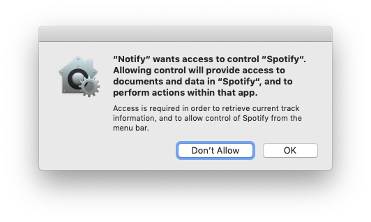
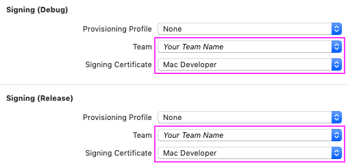

<p align="center">

</p>
<p align="center">


</p>
<p align="center">


</p>

# Spotify Notify

<!-- [](https://travis-ci.org/nahive/spotify-notify) -->
##### *Inspired by [Spotify Notifications](https://github.com/citruspi/Spotify-Notifications) written in Swift*

## [Download latest release here](https://github.com/nahive/spotify-notify/releases)

## Features

- [x] Notification sounds (toggle)
- [x] Notification on play/pause (toggle)
- [x] Customizable status bar icon (default, dark and none)
- [x] Launch on login (toggle)
- [x] Album artwork (toggle)
- [x] Toggle disabling of notifications when Spotify is focused (toggle)
- [x] Shortcuts for showing notification (customizable) ✨
- [x] Show progress of a song in notification ✨
- [x] Ability to skip song from notification ✨
- [x] Options to control Spotify from menu bar ✨
- [ ] Customizable options in notification
- [ ] Add localizations

## Notes

When running the app on macOS Mojave (10.14) or higher, the first time you attempt to control Spotify you will be presented with the following dialog box:

<p align="center"></p>

You must grant permission for the app to work. Choosing Don't Allow will make the app unable to retrieve any information about the currently playing track.

If you click Don't Allow by accident, you can reset the permissions dialogue using

```
$ tccutil reset AppleEvents
```

Additionally, it is now required to sign the app using a paid developer account. To do this, simply set the signing team and certificate in the General settings of the SpotifyNotify target:

<p align="center"></p>

## Building

```
$ git clone https://github.com/nahive/spotify-notify.git
$ cd spotify-notify
$ open SpotifyNotify.xcodeproj
```

## Contributing

If you found a **bug**, open an issue.

If you have a **feature** request, open an issue.

If you want to **contribute**, submit a pull request.

## License

The source code is dedicated to the public domain. See the `LICENCE.md` file for
more information.

The Spotify artwork and icon is owned by Spotify AB Inc.
